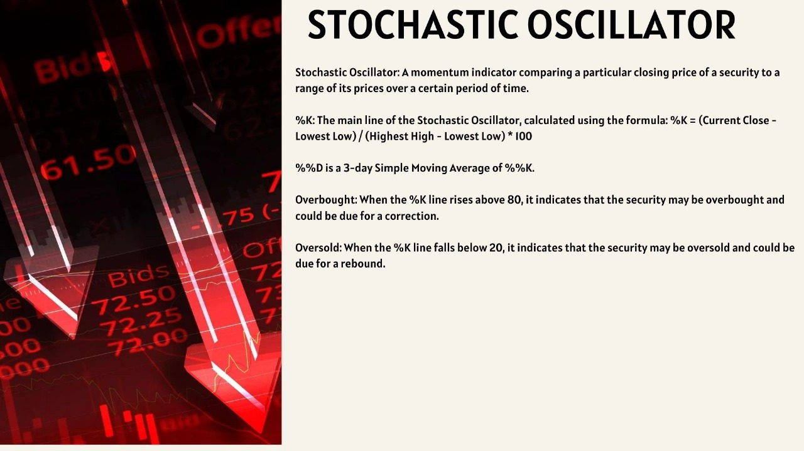
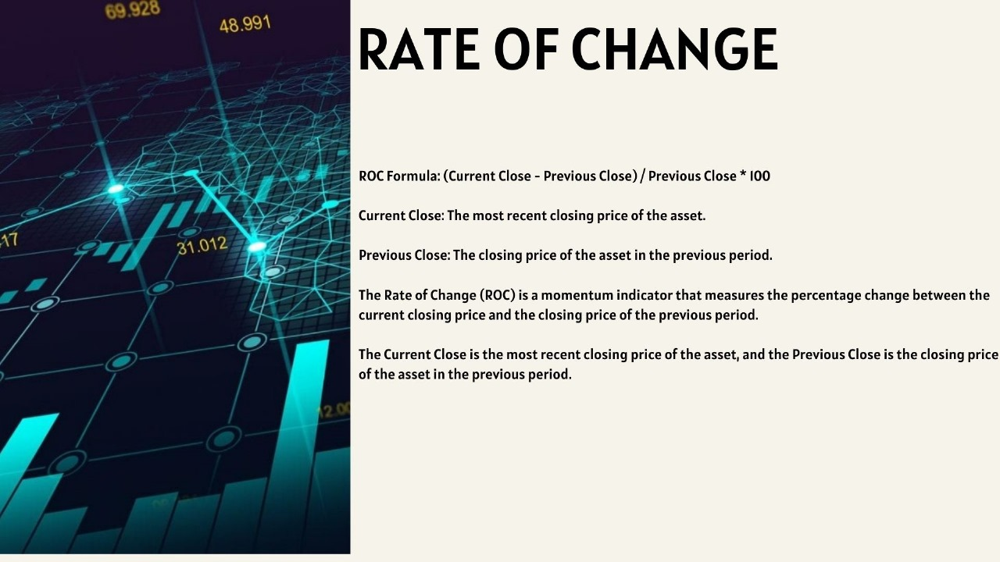
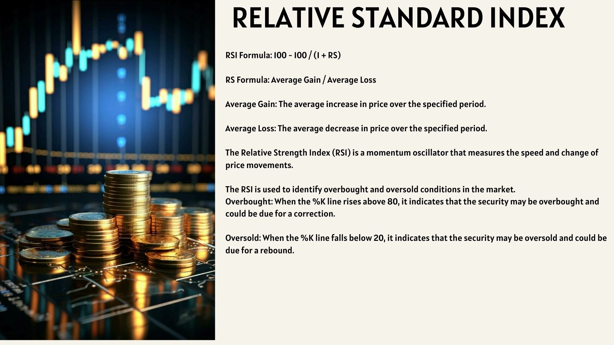
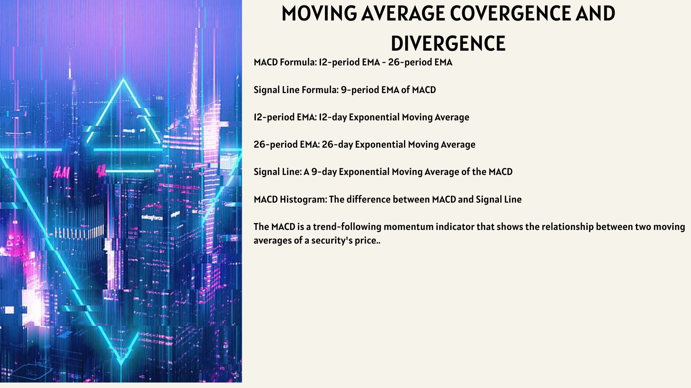
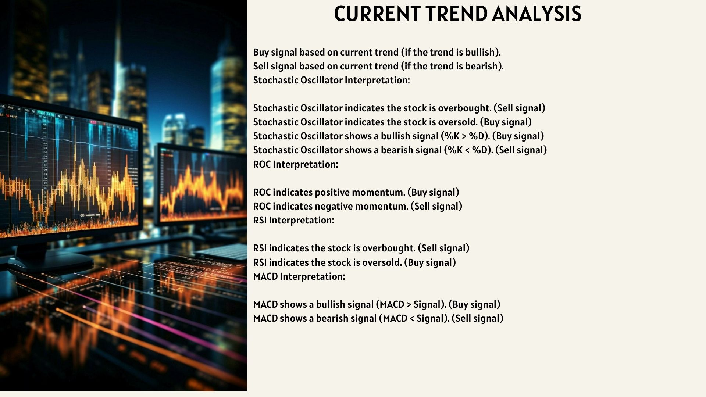
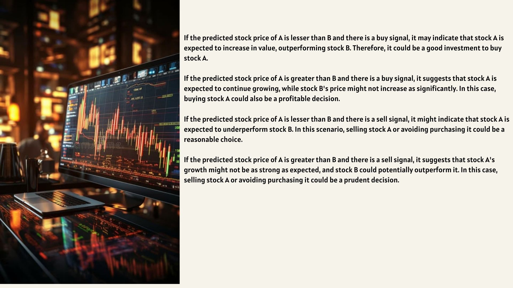

 # Stock Technical Analysis Web App[Stocastic-Oscillators]

This Streamlit web application allows you to perform technical analysis on stock data using multiple indicators, visualize results, and predict future stock prices with machine learning. The app includes interactive navigation, data fetching, indicator visualization, summary statistics, and interpretation of buy/sell signals.

## Features

- **Fetch Stock Data**: Enter a stock symbol and date range to fetch historical price data using [yfinance](https://github.com/ranaroussi/yfinance).
- **Technical Indicators**: Calculate and plot:
  - Stochastic Oscillator (%K, %D)
  - Rate of Change (ROC)
  - Relative Strength Index (RSI)
  - MACD (Moving Average Convergence Divergence)
- **Summary Table**: View the min/max values and dates for Open, High, Low, Close, and Adj Close prices.
- **Interpretation**: Automated interpretation of multiple indicators, generating buy/sell signals.
- **Prediction**: Predict closing price for a user-selected future date using linear regression.
- **Interactive Navigation**: Use the sidebar to switch between data entry, visualization, summary, interpretation, and prediction.

## App Structure & Navigation

- **Enter Data**: Input the stock symbol and date range; fetches and stores data in session state.
- **View Data**: Displays the fetched data in a table.
- **Summary**: Shows minimum and maximum values for price metrics with their corresponding dates.
- **Plots**: Visualize indicators with overlaid price data and overbought/oversold annotations.
- **Interpretation**: Textual and visual summary of indicator-based signals.
- **Prediction**: Choose a date to predict the closing price.

## Screenshots

| Function        | Screenshot                         |
|-----------------|------------------------------------|
| Stochastic Oscillator Plot |  |
| ROC Plot        |                     |
| RSI Plot        |                     |
| MACD Plot       |                   |
| Interpretation  |           |
| Prediction Note |                   |

## Requirements

- Python 3.8+
- [Streamlit](https://streamlit.io/)
- yfinance
- talib
- scikit-learn
- pandas, numpy, matplotlib

Install dependencies with:
```bash
pip install streamlit yfinance ta-lib scikit-learn pandas numpy matplotlib
```

> **Note:** For Windows, you may need to install [TA-Lib binaries](https://www.lfd.uci.edu/~gohlke/pythonlibs/#ta-lib) before running `pip install ta-lib`.

## Usage

1. Place all files in the same directory:
   - `fe.py`
   - `analysis.jpg`
   - `macd.jpg`
   - `note.jpg`
   - `roc.jpg`
   - `rsi.jpg`
   - `stoc.jpg`
2. Run the app:
   ```bash
   streamlit run fe.py
   ```
3. Follow the sidebar navigation to use the features.

## File Overview

- **fe.py**: Main Streamlit app containing all code logic.
- **analysis.jpg, macd.jpg, note.jpg, roc.jpg, rsi.jpg, stoc.jpg**: Visual aids and example plots used within the app.

## Visual Reference

Below is an example of the project folder structure:

```
your_project/
├── analysis.jpg
├── fe.py
├── macd.jpg
├── note.jpg
├── roc.jpg
├── rsi.jpg
└── stoc.jpg
```

## Example


---

### Disclaimer

- This app is for educational and informational purposes only and should not be used as financial advice.
- Data is fetched from Yahoo Finance and is subject to availability and accuracy.

---

**Enjoy exploring technical analysis with interactive Python!**
